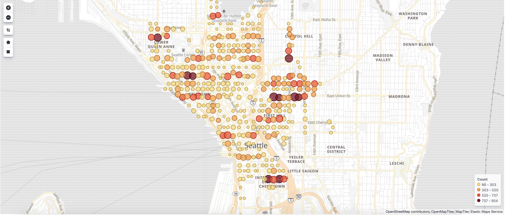

## Analyzing Seattle Parking Data
The city of Seattle open data portal provides data about parking meters installed across the city. We use this data to
analyze which spots are more popular and thus face more influx. 

You can run this project locally. The instructions to setup the project are quick and specified in this file. 

### Data Format
Following are the columns present in the input data -
- OccupancyDateTime: The date and time (minute) of the transaction as recorded
- PaidOccupancy: The number of vehicles paid for parking at this time
- BlockfaceName: Street segment, name of street with the "from street" and "to street";
- SideOfStreet: Options are: E, S, N, W, NE, SW, SE, NW.
- SourceElementKey: Unique identifier for the city street segment where the pay station is located
- ParkingTimeLimitCategory: In minutes
- ParkingSpaceCount: Number of paid spaces on the blockface at the given date and time
- PaidParkingArea: Primary name of a paid parking neighborhood
- PaidParkingSubArea: Subset of a paid parking area
- PaidParkingRate: Parking rate charged at date and time
- ParkingCategory: An overall description of the type of parking allowed on a blockface
- Location: Geographical coordinates 

### Architecture
```$xslt
                               +--------------------+                    +---------------------+                   +--------------------+
Parking Meter                  |                    |                    |                     |                   |                    |
     Data    +---------------->+    Apache Flink    +------------------->+    Elasticsearch    +------------------>+      Kibana        |
                               |                    |                    |                     |                   |                    |
                               |                    |                    |                     |                   |                    |
                               +--------------------+                    +---------------------+                   +--------------------+
```
We use Apache Flink to stream the locally downloaded data. We use a sliding window for streaming through the events with
a window size of 15 minutes and a slide of 5 minutes. The stream time characteristic used was Event Time. Since the
data came with it's own timestamp for the events, we used this during the streaming process by deriving the timestamp 
and watermark values from this.

Each parking event is associated with a parking meter's geographical coordinates. The map of seattle was broken up into
square blocks numbered sequentially from the north-west corner to the south-east corner. The parking counts of all the
parking meters in each of these blocks across 15 minutes were summed up and inserted in elasticsearch.

Kibana was then hooked up the index that we created in elasticsearch and the visualization was created.

### Visualizations
#### Popular parking spots



### Setting up
#### Apache Flink
There is no setup required for Apache Flink as we run locally in an embedded execution mode in a single JVM using the 
dependency libraries we have declared.

#### Elasticsearch
Start up a docker instance of Elasticsearch 7.x
```bash
docker pull docker.elastic.co/elasticsearch/elasticsearch:7.4.2

docker run -d -p 9200:9200 -p 9300:9300 -e "discovery.type=single-node" --name elasticsearch docker.elastic.co/elasticsearch/elasticsearch:7.4.2
```

Elasticsearch 7.x does away with types in indexes. So we create a typeless index.
```bash
curl -XPUT "http://localhost:9200/seattle-parking-index3"

curl -XPUT "http://localhost:9200/seattle-parking-index3" -H 'Content-Type: application/json' -d'
{
 "mappings" : {
   "properties" : {
      "count": {"type": "integer"},
      "location": {"type": "geo_point"},
      "time": {"type": "date"}
    }
 }
}'
```

#### Kibana
Kibana 7.x is compatible with Elasticsearch 7.x. So we run a docker container with that version of Kibana. We need to
make sure we link the two containers together.
```bash
docker pull docker.elastic.co/kibana/kibana:7.4.2

docker run -d --link elasticsearch -p 5601:5601 --name kibana docker.elastic.co/kibana/kibana:7.4.2
```

Navigate to http://localhost:5601/app/kibana in your browser

Discover your elasticsearch index using instructions from https://www.elastic.co/guide/en/kibana/current/connect-to-elasticsearch.html

#### Running the application
To run the application, simply navigate to the root of the repository and run
```bash
./gradlew run
```

